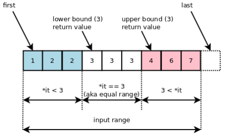

# Basic C++, Methods

알고리즘 풀이에 사용되는 다양한 C++의 함수를 공부하고 정리한 자료입니다.   

<br>

index   
1. fil( ), memset( )
2. memcpy( ), copy( )
3. sort( )
4. stable_sort( )
5. unique( )
6. lower_bound( ), upper_bound( )
7. accumulate( )
8. max_element( )
9. min_element( )
10. 메모리 주소끼리의 뺄셈
11. 값에 의한 호출, 참조에 의한 호출

<br>
<br>
<br>

## 1. fill( ), memset( )
배열을 초기화 할 때 사용하는 함수.   
fill()은 모든 값으로 초기화할 수 있다.   
memset()은 -1, 0으로만 초기화할 수 있음.   
fill()이 더 편하지만 -1,0의 경우 memset이 더 빠르기 때문에 memset을 쓰는게 좋음.
### fil( )
O(n)의 시간복잡도를 가짐.   
```c++
void fill(ForwardIterator first, ForwardIterator last, const T& val); 
//fill(시작값, 끝값+1, 채울값) 끝값은 포함하지 않고 그 이전까지 초기화함.

int a[10];
int b[10][10];

fill(&a[0], &a[10], 100); // 마지막값은 포함하지 않기 때문에 마지막 값인 a[9] 다음 주소인 a[10]을 제시해야함.
fill(a, a+10, 200); // 1차원 배열의 경우 배열이름 + 숫자로 사용할 수 있음
fill(&b[0][0], &b[0][0] + 10*10, 7); // 2차원은 이름+숫자 못씀.. 주소+숫자는 가능하다.
fill(&b[0][0], &b[9][10], 6);
```
   
### memset( )
memset()은 바이트 단위로 초기화하며, 0, -1, char형 1문자로 초기화할때만 사용함.

```c++
void * memset(void * ptr, int value, size_t num);
// memset(배열이름, 채울값, 배열크기)
int a1[1000];
int a2[1000][1000];
char a[1000][1000];
memset(a1, -1, sizeof(a1)); // 배열이름, 채울값, 배열크기
memset(a2, 0, sizeof(a2));
memset(a, 'K', sizeof(a)); // 문자로도 된다.
```

### {, }
```c++
int a[10] = {0, };
```
이런식으로 초기화는 가능하나 초반에 한번 하는 정적 코드에만 정상적으로 동작한다.

<br>

## 2. memcpy( ), copy( )

### Shallow Clone & Deep Clone
어떤 변수를 복사할 때 Shallow Clone(얕은 복사)를 하면 메모리 주소값만을 복사하고, Deep Clone(깊은 복사)를 하면 새로운 메모리 공간을 할당하고 값을 복사해 하나 더 생성한다.(주소값도 새로 생긴다.)   
   
얕은 복사를 하게 되면 주소값만을 복사하기 때문에 복사한 변수를 사용하면 원본 변수의 값도 변경된다.   
깊은 복사를 하게 되면 새로운 주소에 값이 생성되므로 원본과는 별개로 사용할 수 있다.   
   
memcpy()는 Array 깊은 복사에,   
copy()는 Array, vector 깊은 복사에 사용된다.

### memcpy( ) - 깊은복사 - Array
memcpy()는 어떤 변수의 메모리에 있는 값들을 다른 변수의 **"특정 메모리값"**으로 복사한다.
복사 후에도 기존 배열의 값이 수정되지 않은 상태값이 필요할 때 사용한다.
```c++
memcpy(void* destination, const void* source, size_t num)
// 도착공간, 출발소스, 소스크기

int v[3] = {1,2,3};
int ret;
ret = memcpy(ret, v, sizeof(v));
```
   
memcpy()로 복사할 대상이 겹치거나, 단순 복사 가능하지 않은 경우를 Trivially Copyable이라고 하며, 이때 memcpy()는 제대로 동작하지 않는다.
is_trivial() 함수로 이를 체크할 수 있다.
```c++
if(is_trivial<vector<int>>()){
    cout << "trivially copyable!! no can do" << endl;
    // vector는 사용할 수 없다. trivaially copyable
    // memcpy()는 array에만 쓸 수 있다.
}
```

#### memcpy( ) 사용 시 주의할 점
memcpy()를 쓸 때 복사하는 배열(src)과 복사되는 대상(dest) 배열의 메모리가 겹치면 UB 에러가 발생한다.   
```c++
int a[8];
memcpy(&a[1], a, sizeof(int) * 7); // 같은 배열에 복사를 선언. UB 에러 발생!!
```

### copy( ) - 깊은복사 - Array, Vector
memcpy()와 같은 동작을 Array, Vector 모두에 수행가능한 함수
```c++
copy(InputIterator first, InputIterator last, OutputIterator result);
//copy(복사할 배열/벡터 시작메모리, 복사할 배열/벡터 끝 메모리+1, 복사해넣을 장소 시작메모리)
copy(v.begin(), v.end(), ret.begin());
```
input vector과 output vector의 크기를 동일하게 맞추고 집어넣어야 하는 것이 중요하다.   
   
배열의 크기는 컴파일 시간에 상수여야 하므로 const int로 선언 후 배열 선언을 하는 것이 옳다. 그렇지 않을 경우 모든 C++ 컴파일러에서 제대로 컴파일 되지 않을 수 있음.

<br>

## 3. sort( )
배열 등 컨테이너들의 요소를 정렬하는 함수. O(logn)의 시간복잡도.   
```c++
sort(first, last, *커스텀비교함수(선택));
//sort(정렬하고 싶은 배열/컨테이너의 첫번째 이터레이터, 정렬하고 싶은 배열의 마지막 이터레이터, 커스텀 비교함수) 
```
[fist,last)의 범위. 마지막은 포함하지 않는다는 뜻.   
커스텀 비교함수는 넣지 않으면 오름차순으로 정렬함.   
less<타입>() 으로 오름차순,   
greater<타입>() 으로 내림차순으로 변경

```c++
int v[3] = {3,2,1};
sort(v.begin(), v.end()); // 3,2,1 -> 1,2,3
sort(v.begin(), v.end(), greater<int>()) // 1,2,3 -> 3,2,1
```

### 커스텀 비교함수 만들기 CMP
pair로 이루어진 벡터의 경우 기본으로 first, second 순으로 오름차순 정렬되지만   
first를 내림차순, second를 오름차순으로 정렬하고 싶다면? cmp를 만들어 투입하면 된다.
```c++
vector<pair<int,int>> v;

bool cmp(pair<int,int> a, pair<int, int> b){
	return a.first > b.first;
}

int main(){
	for( int i=10; i>=1; i--) v.push_back({i,10-i});
	
	sort(v.begin(), v.end(), cmp);
	
	for(auto it:v) cout << it.first << " : " << it.second << endl;
	
	return 0;
}
```
   
cmp를 통해 sort()가 a,b에 들어가는 수가 cmp에서 true가 나오는지를 확인하는 과정을 통해 정렬한다는 것을 알 수 있다.
   

<br>

## 4. stable_sort( )
sort()와 사용법은 같다.
```c++
stable(v.begin(), v.end(), cmp);
```
sort()는 불안정 정렬 알고리즘을 사용한다. 같은 값을 가진 요소들의 들어온 순서를 보장하지 않는다.   
stable_sort()는 안정 정렬 알고리즘을 사용한다. 같은 값을 가진 요소들은 들어온 순서를 보존해 지켜준다.

<br>

## 5. unique( )
범위 안의 요소를 앞에서부터 두개씩 서로 비교하여 중복되는 요소를 삭제하는 함수. O(n)의 시간복잡도.   
```c++
iterator unique(v.begin(), v.end());
```
중복되는 요소를 삭제하고 마지막 요소의 다음 주소, 즉 새로운 끝을 반환한다.
```c++
for(int i=1; i<=5; i++){
	v.push_back(i);
	v.push_back(i);
}
for(int i : v) cout << i << ' ';
cout << endl;
	
auto it = unique(v.begin(), v.end());
cout << it - v.begin() << endl; // 새로운 끝 - 시작 : 즉 남은 요소의 수
	
for(int i : v) cout << i << ' ';
cout << endl;
return 0;
```
중복되는 요소를 제거하고 앞에서부터 새로 채워넣지만 남은 요소는 건드리지 않기에 제거된 요소 수만큼의 양이 뒤에 그대로 남게된다.   
   
sort()와 erase()와 같이 사용해서 중복되지 않은 요소만 남게 해야한다.
```c++
// erase()
vector<int> v = {1, 2, 3, 4, 5};
v.erase(v.begin() + 1, v.begin() + 4);  // 인덱스 1부터 3까지 삭제
// v == {1,5}
```

### erase()와 unique() 조합
unique는 중복된 연속 요소를 제거하고 새로운 끝의 이터레이터를 반환함.
erase는 주어진 처음, 끝 이터레이터를 모두 포함한 범위를 지움

```c++
vector<int> v = {1, 2, 2, 3, 3, 4};
v.erase( unique(v.begin(), v.end()),  v.end());
```

### sort()와 unique() 조합
uinque()는 중복된 연속 요소만 제거하므로 정렬후 사용해야 합니다 ,, ,,

<br>

## 6. lower_bound( ), upper_bound( )
정렬된 배열에서 어떤 값이 나오는 첫번째 지점 또는 초과하는 지점의 위치를 찾으려면? 또는 이분탐색을 쉽게 함수로 구현하려면?   
즉, 어떤 값을 기준으로 배열을 나누려면?   

```c++
vector<int> a {1,2,3,3,3,4};	
cout << lower_bound(a.begin(), a.end(), 3) - a.begin() << endl; //2 (배열의 [2]번째 값)
cout << upper_bound(a.begin(), a.end(), 3) - a.begin() << endl; //5 (배열의 [5]번째 값)
```
꼭 정렬이 완료된 배열에서 사용해야 한다.   

lower_bound()는 기준값 이상(>=)인 첫번째 위치를 반환.   
upper_bound()는 기준값 초과(>)인 첫번째 위치를 반환한다.   
   
더 자세하게 말하면 lower_bound(), upper_bound()는 주어진 기준값의 시작'이터레이터', upper는 기준값 다음값의 시작 '이터레이터'를 반환한다. O(logn)의 시간복잡도를 가진다.   
   
때문에 .begin()으로 배열의 시작점을 빼주어야(주소값 끼리 빼기) 몇번째 값인지를 알아내 사용할 수 있다.
   
lower_bound는 기준값의 시작주소, 즉 기준값보다 작은 값의 마지막주소+1,   
upper_bound는 기준값의 마지막주소+1, 즉 기준값보다 큰 값의 시작주소를 반환하므로 다음과 같이 값만 꺼내 쓸수도 있다.   
```c++
vector<int> a {1,2,3,3,4,100};
cout << *(lower_bound(a.begin(), a.end(), 4)-1) << endl; //3
cout << *upper_bound(a.begin(), a.end(), 4) << endl; //100
```
   
lower과 upper를 응용해서 같은 값이 몇개인지를 알아낼 수도 있다.
```c++
vector<int> a {1,2,3,3,3,3,4,100};
cout << upper_bound(a.begin(), a.end(), 3) - lower_bound(a.begin(), a.end(), 3) << endl; //4
```
   
다만 기준값으로 넣은 값이 배열/벡터 내에 없을 경우 lower, upper bound모두   
기준값보다 큰 값이 있으면 해당 값의 위치를 반환한다.   
기준값보다 큰 값이 없으면 배열/벡터의 끝 위치를 반환한다.   
   
<br>

## 7. accumulate( )
배열의 합을 쉽고 빠르게 구해주는 함수   
```c++
vector<int> v = {1,2,3,4,5,6,7,8,9,10};
int sum = accumulate(v.begin(), v.end(), 10);
// accumulate(배열/벡터 시작, 배열/벡터 끝, 추가할 수)
cout << sum << endl;
```
<br>

## 8. max_element( )
배열 중 가장 큰 요소를 추출하는 함수   
이터레이터를 반환하므로 *를 통해 값을 끄집어내거나 이를 기반으로 최댓값의 인덱스를 뽑아낼 수 있다.
```c++
vector<int> v = {1,2,3,4,5,6,7,8,9,10};
	
int max = *max_element(v.begin(), v.end());
auto max_it = max_element(v.begin(),v.end());
	
cout << max << endl;
cout << (int)(max_it - v.begin()) << endl; // 몇번째 인덱스인지 
```
<br>

## 9. min_element( )
배열 중 가장 작은 요소를 추출하는 함수   
max와 사용법이 같다.
```c++
vector<int> v = {1,2,3,4,5,6,7,8,9,10};
	
int min = *min_element(v.begin(), v.end());
auto min_it = min_element(v.begin(),v.end());
	
cout << min << endl;
cout << (int)(min_it - v.begin()) << endl; // 몇번째 인덱스인지 
```
<br>

## 10. 메모리 주소끼리의 뺄셈
```c++
auto it = lower_bound(a.begin(), a.end(), 3);
cout << it - a.begin() << endl;
```
이 코드는 it이터레이터와 a.begin() 사이의 인덱스 차이값을 출력한다.   

C++에서 포인터나 이터레이터의 뺄셈 연산은 메모리 주소차이를 바이트 단위가 아닌 요소의 인덱스 차이로 반환하기 때문임

<br>

## 11. 값에 의한 호출, 참조에 의한 호출

### 매개변수

### 값에 의한 호출, Call by value

### 참조에 의한 호출, Call by Reference


<br>