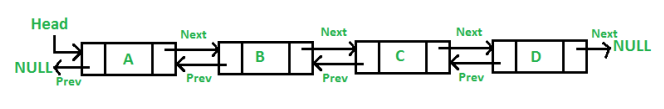
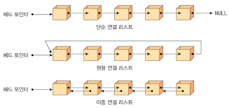

# Basic C++, Data Structures(Vector & Array & List)

알고리즘 풀이에 사용되는 다양한 C++의 자료구조 중 Vector, Array, List를 공부하고 정리한 자료입니다.

<br>

index

- [Basic C++, Data Structures(Vector \& Array \& List)](#basic-c-data-structuresvector--array--list)
  - [1. Vector](#1-vector)
    - [1.1. push\_back()](#11-push_back)
    - [1.2. pop\_back()](#12-pop_back)
    - [1.3. erase()](#13-erase)
    - [1.4. find(from, to, value)](#14-findfrom-to-value)
    - [1.5. clear()](#15-clear)
    - [1.6. fill(from, to, value)](#16-fillfrom-to-value)
    - [1.7. 범위기반 for loop](#17-범위기반-for-loop)
    - [1.8. vector 정적할당](#18-vector-정적할당)
    - [1.9. vector의 2차원 배열](#19-vector의-2차원-배열)
  - [2. Array](#2-array)
    - [2.1. 2차원 배열과 탐색](#21-2차원-배열과-탐색)
  - [3. List](#3-list)
    - [3.1 싱글 연결리스트](#31-싱글-연결리스트)
    - [3.2 이중 연결리스트](#32-이중-연결리스트)
    - [3.3 원형 연결리스트](#33-원형-연결리스트)
    - [3.4. 리스트 사용 예시](#34-리스트-사용-예시)
  - [4. Array vs List](#4-array-vs-list)
    - [4.1. 배열과 연결리스트에서의 삽입/삭제 시간복잡도](#41-배열과-연결리스트에서의-삽입삭제-시간복잡도)


<br>
<br>
<br>

## 1. Vector
Vector는 동적으로 요소를 할당할 수 있는 동적배열이다.   
컴파일 시기에 사용해야 할 요소들의 개수가 명확하지 않다면 array가 아닌 vector를 써야함   
   
탐색, 맨 뒤나 앞 요소의 삭제, 삽입에 O(1)의 시간복잡도,   
중간 요소의 삭제, 삽입에 O(n)의 시간복잡도를 가짐   

```c++
vector<Type> name; // 선언
```
   
**vector 사용 예시**
```c++
vector<int> v;

int main(){
	for(int i=1; i<=10; i++) v.push_back(i);
	for(int a : v) cout << a << " ";
	cout << endl;
	
	v.pop_back();
	for(int a : v) cout << a << " ";
	cout << endl;
	
	v.erase(v.begin(), v.begin()+3);
	for(int a : v) cout << a << " ";
	cout << endl;
	
	auto a = find(v.begin(), v.end(), 100);
	if(a == v.end()) cout << "not found" << endl;
	
	fill(v.begin(), v.end(), 10);
	for(int a : v) cout << a << " ";
	cout << endl;
	
	v.clear();
	cout << "아무도 없을까나리?" << endl;
	for(int a : v) cout << a << " ";
	cout << endl;
	
	return 0; 
}

```

### 1.1. push_back()
뒤에서부터 요소 더하기. 같은 기능을 하는 emplace_back()도 있음   
<br>

### 1.2. pop_back()
vector 맨 뒤의 요소를 지움(반환 x)   
<br>

### 1.3. erase()
한 요소만 지울 시 해당 위치의 파라미터만 전달,
번위를 지우고 싶다면 [from, to)로 이터레이터를 전달할 것

```
[ ]은 포함하는 구간, ( )은 포함하지 않는 구간을 의미함
ex. [1,3) -> 1,2
(8, 9, 10, 11] -> 9, 10, 11
```
<br>

### 1.4. find(from, to, value)
vector의 메소드가 아닌 STL 함수.   
[from, to)에서 value를 찾음. O(n)의 시간복잡도   
<br>

### 1.5. clear()
vector의 모든 요소를 삭제   
<br>

### 1.6. fill(from, to, value)
vector 내의 모든 요소를 value 값으로 할당.   
[from, to) 구간의 value를 초기화   
<br>

### 1.7. 범위기반 for loop
C++ 11 부터 범위기반 for loop 사용가능.   
vector, array, map 모두 사용가능하다.   
```c++
vector<int> v {1,2,3};

int main(){
    // 기본적인 for loop
	for(int i=0; i<v.size(); i++) cout << v[i] << ' ';
	cout << endl;
    
    // 범위기반 for loop. 같은 동작
	for(int a : v) cout << a << " ";
	cout << endl;
	
	
	vector<pair<int,int>> v2 = {{1,2},{3,4}};
    // vector안에 pair가 들어간다면 이를 명시해줘야함.

	for(pair<int,int> a : v2) cout << a.first << " ";
	cout << endl;

	for(auto a : v2) cout << a.second << " ";
    // 아니면 auto를 쓰던가..
}
```
<br>

### 1.8. vector 정적할당
vector라고 해서 무조건 크기가 0인 빈 벡터를 만들어 동적할당으로 요소를 추가하는 것은 아님.   
   
미리 값을 넣어 생성할 수 있다.
```c++
vector<int> v {1,2,3,4,5};
vector<int> v2(5, 100); // 크기가 5인 배열을 100으로 채워서 선언
```
<br>

### 1.9. vector의 2차원 배열
3가지 방법으로 2차원 벡터를 선언할 수 있다.
```c++
vector<vector<int>> v; // 모양만 선언
vector<vector<int>> v2(10, vector<int>(10,0)); // 사이즈와 초기화까지 선언. 사이즈 10x10, 0으로 초기화

vector<int> v3[10]; // int 벡터 10개짜리의 '배열'

int main(){
	for(int i=0; i<10; i++){
		vector<int> temp;
		v.push_back(temp);
	}
}
```

<br>
<br>

## 2. Array
정적 배열. 보통 선언 시 크기를 설정해서 선언함   
연속된 메모리 공간에 위치한 같은 타입 요소들의 모음, 숫자 인덱스를 기반으로 접근이 가능하다.   
```c++
// C 스타일 선언
int a[3];
int a[2] = {1,2,3};
// Std 스타일 선언
array<int, 10> a;
```
   
vector과 다르게 내장 메서드가 없다.
### 2.1. 2차원 배열과 탐색
```c++
// 선언
const int y=3;
const int x=4;
int a[y][x];

//탐색
for(int i=0; i<mxy; i++){
		for(int j=0; j<mxx; j++){
			cout << a[i][j] << ' ';
		}
	    cout << endl;
	}
```
첫번째 차원 -> 두번째 차원 순으로 탐색하는 것이 효율이 좋다.   

<br>
<br>

## 3. List
요소가 인접한 메모리 위치에 저장되지 않는 선형 자료구조.   
인덱스로 접근 불가, 오로지 순차적으로 접근만 가능함   
   
요소들은 next, prev라는 포인터로 연결되어 있다.   


데이터를 감싼 노드를 포인터로 연결, 공간적인 효율성을 극대화 시킨 자료구조.   
삽입, 삭제에 O(1)이 걸리며 K번째 요소를 참조하려면 O(K)의 시간복잡도를 가짐.   




### 3.1 싱글 연결리스트
노드에 다음노드를 가리키는 next 포인터밖에 없어 한 방향으로만 데이터가 연결됨.   

### 3.2 이중 연결리스트
각 노드에 prev, next 두개의 포인터로 양방향을 가르키므로 양쪽으로 탐색 가능.   

### 3.3 원형 연결리스트
마지막 노드와 첫번째 노드가 연결되어 원을 형성한다.


**원형 싱글 연결리스트**   
싱글리스트와 같이 한 방향으로만 탐색 가능   

**원형 이중 연결리스트**   
이중리스트와 같이 양방향으로 탐색 가능   

### 3.4. 리스트 사용 예시
```c++
#include <bits/stdc++.h>
using namespace std;

list<int> a;

void print(list<int> li){
	for(auto it : li) cout << it << ' ';
	cout << endl;
}

int main(){
	for(int i=1; i<=3; i++) a.push_back(i); // 뒤에서부터 value를 넣음 
	for(int i=1; i<=3; i++) a.push_front(i);  // 앞에서부터 value를 넣음
	
	auto it = a.begin();
	it++;
	a.insert(it, 1000); //요소를 몇번째에 삽입 
	print(a);
	
	a.erase(it); // 몇번째 요소를 삭제 
	print(a); 
	
	
	cout << "a.front() : " << a.front();// 맨 앞 요소 참조
	cout << endl;
	 
	a.pop_front(); // 맨 앞 요소 삭제 
	print(a);
	
	cout << "a.back() : " << a.back(); // 맨 뒤 요소 참조 
	cout << endl;
	
	a.pop_back(); // 맨 뒤 요소 삭제 
	print(a);
	
	a.clear(); // 요소 전체 삭제 
	print(a);
	return 0;
}

```

<br>
<br>

## 4. Array vs List

배열은 연속된 메모리 공간에, 연결리스트는 연속되지 않은 메모리 공간에 데이터를 저장한다.   
   
배열 삽입, 삭제 : O(n)   
배열 참조 : O(1)
   
연결리스트 삽입 삭제 : O(1)   
연결리스트 참조 : O(n)   
   
데이터 참조가 많은 경우 배열을, 삽입/삭제가 많은 경우 연결리스트를 사용하는 것이 좋다.   

### 4.1. 배열과 연결리스트에서의 삽입/삭제 시간복잡도

배열의 중간에 원소를 삽입/삭제 하는 경우, 연속된 메모리를 유지해야 하므로 나머지 원소들의 위치조정이 필요하므로 O(n)의 시간복잡도를 소모한다.   
   
연결리스트의 경우, 삽입해야 할 위치를 모를 시 동일하게 O(n)이 필요하나 대부분 삽입/삭제할 노드의 포인터를 알고 있는 경우에서 쓰기 때문에 평균적으로 O(1)의 매우 짧은 시간복잡도를 소모한다.

<br>