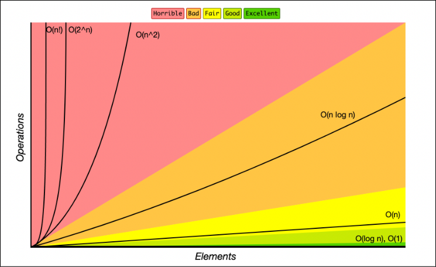

# Time & Space Complexity

## Time Complexity, 시간복잡도
시간복잡도란, 입력 크기에 대해 어떠한 알고리즘이 실행되는데 소모되는 시간   
반복횟수를 중점으로 측정된다.

정확한 소모된 시간이 아닌, 로직의 반복 횟수를 봐야한다.   

```c++
for(int i=0; i<10; i++){
    for(int j=0; j<n; j++){
        for(int k=0; k<n; k++){
            cout << i << endl;
        }
    }
}
```
위 코드에서 cout은 몇번 반복되는가?   
10 * n * n = 10n^2 번 반복된다.

## Big-O 표기법
복잡도에 가장 영향을 많이 끼치는 항의 상수 인자를 빼고, 나머지 항을 없애서 복잡도를 나타내는 표기법   
   
가장 많이 영향을 끼치는 항이란, 입력크기(n)이 커질수록 증가속도가 큰 항.   

자세하게 잰 시간복잡도가 10n^2+n 인 로직을 보면,   
가장 크게 시간을 잡아먹는 항은 10n^2 이다.   

그중에서도 상수인 10을 제거하면, 다음과 같이 표기할 수 있다. n^2   

O(n) = 10n^2+n -> n^2


위와 같은 속도로 증가속도가 차이가 난다.   
크게 보면 n! > 2^n > n^2 > n logn > n > logn > 1

순으로 시간 복잡도를 소모한다고 볼 수 있다.

### 상수시간 복잡도 O(1)

입력 크기와 상관없이 일정한 시간복잡도를 가지는 로직이며, 1의 시간복잡도로 생각한다.   

**상수시간 복잡도를 가지는 연산**
```
입력 출력 : cin, cout, scanf, printf
곱하기, 나누기, 나머지연산, 빼기
if문
배열의 인덱스 참조
```

## 시간복잡도 측정하기

```c++
int n;

int main(){
    cin >> n;
    int a = 0;
    for(int i=0; i<n; i++){
        for(int j=0; j<i; j++){ //1~n
            a+= i+j; 
        }
    }
    cout << a << endl;//1
    return 0;
}
```
위 코드의 시간복잡도는?  
O(n) = 1 + 2 + 3 + ... + n
O(n) = 1/2 * (n^2 - n)
O(n) = n^2


